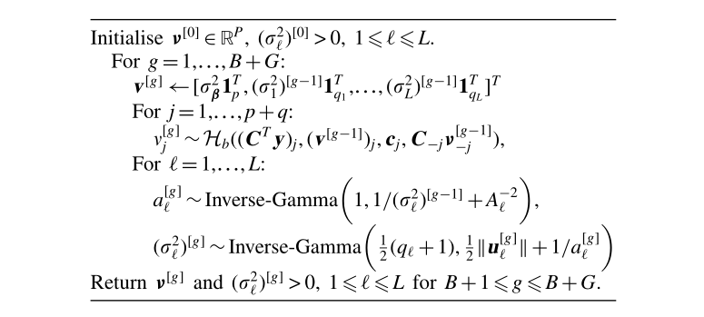

```{r setup, echo=F}
knitr::opts_knit$set(root.dir = getwd())
knitr::opts_chunk$set(echo = FALSE, results = 'hide')
knitr::opts_chunk$set(warning = FALSE, message=FALSE)
```

```{r prepare}
rm(list=ls())
options(digits=4)
options(scipen=100)
graphics.off()
Sys.setlocale("LC_ALL", "Chinese")
```


# 广义可加混合模型参数估计 
## 广义可加混合模型
假如 $n$ 个单位中的第 $i$ 个观测对象包含一个因变量 $y_i$ ,和 $p$ 个与固定效应相联系的协变量
 $x_{i}=\left(1, x_{i 1}, \ldots, x_{i p}\right)^{\mathrm{T}}$ 和 $q$ 个与随机效应相联系的
协变量 $z_{i}$ .给定1个 $q\times 1$ 维的随机效应向量 $b$ ，并且假定因变量 $y_i$ 满足
条件独立，其均值为 $E\left(y_{i}|b\right)=\mu_{i}^{b}$ ,方差为
 $\operatorname{var}\left(y_{i}|b\right)=\phi m_{i}^{-1} v\left(\mu_{i}^{b}\right)$ ,
 $v(\cdot)$ 表示一个具体的方差函数， $m_i$ 表示先验权重（例如一个二项分母）， $\phi$ 是一个尺度参数，以下给出的是一个广义可加模型。
 
$$g\left(\mu_{i}^{b}\right)=\beta_{0}+f_{1}\left(x_{i 1}\right)+\ldots+f_{p}\left(x_{i p}\right)+z_{i}^{\mathrm{T}} b$$ {#eq:m-99-1}

其中 $g(\cdot)$ 表示一个单调可导连接函数，$f_j(\cdot)$ 是一个中心化的二阶可导光滑函数，随
机效应 $b$ 被假定服从分布 $N\sim (0,D(\theta))$ 并且 $\theta$ 是一个 $c\times1$ 的方差成分
向量。

GAMM[@eq:m-99-1]的一个关键特征是，用加性非参数函数来构建协变量效应，用随机效应来描述观测之间的相关
性。如果 $f_j(\cdot)$ 是一个线性函数，GAMM[@eq:m-99-1]约等于Breslow和Clayton的GLMM(1993)[@Breslow1993]。Zeger和
Diggle(1994)和Zhang等人(1998)考虑了GAMM[@eq:m-99-1]的一个特例，一个半参数混合模型，他们假设了一个
单非参数时间函数 $f(\cdot)$ 和具有正态分布因变量的纵向数据[@Zeger1994;@Zhang1998]。

模型形式(1)包括各种研究设计，如聚类、层次和空间设计。这是因为我们可以指定随机效
应 $b$ 的灵活协方差结构。例如，对于纵向数据，随机效应 $b$ 可以分解为随机截距
和随机过程(Zeger and Diggle, 1994;Zhang等人，1998)对于分层(多水平)数据，可以将其
划分为代表分层的不同水平，例如，多中心临床试验中的中心、医生和患者(Lin和
Breslow1996)[@Zeger1994;@Zhang1998;@lin1996bias]。对于疾病制图和生态研究中常见的
空间数据，它们可以用来构建空间相关性，空间相关性通常被假设为每两个区域之间的欧氏
距离的函数(Cressie, 1993)，或者每两个相邻区域之间的常数(Breslow和Clayton,
1993)[@Cressie1993;@Breslow1993]。

$\left\{\beta_{0}, f_{1}(\cdot), \ldots, f_{p}(\cdot), \theta\right\}$ 完整的对数拟似然是：
$$\exp \left[l\left\{y ; \beta_{0}, f_{1}(\cdot), \ldots, f_{p}(\cdot), \theta\right\}\right] \propto|D|^{-1 / 2} \int \exp \left\{-\frac{1}{2 \phi} \sum_{i=1}^{n} d_{i}\left(y_{i} ; \mu_{i}^{b}\right)-\frac{1}{2} b^{\mathrm{T}} D^{-1} b\right\} \mathrm{d} b$$ {#eq:m-99-2}
其中 $y=\left(y_{1}, \ldots, y_{n}\right)^{\mathrm{T}}$ 和
$$d_{i}\left(y_{i} ; \mu_{i}^{b}\right) \propto-2 \int_{y_{i}}^{\mu_{i}^{b}} m_{i}\left(y_{i}-u\right) / v(u) \mathrm{d} u$$
定义了给定 $b$ 时 $\left\{\beta_{0}, f_{1}(\cdot), \ldots, f_{p}(\cdot)\right\}$ 的条件偏差
函数。假设 $D$ 是一个满秩矩阵可以使以上简单化。如果 $D$ 不是一个满秩矩阵，则可以
用摩尔广义逆。

GAMM[@eq:m-99-1]中的统计推断涉及对非参数函数 $f_j(\cdot)$ 的推断，通常需要估计光滑参数，如 
$\lambda$，以及推断方差成分 $\theta$ 。在接下来的两部分中。我们将首先讨论
如何构造已知 $\lambda$ 和 $\theta$ 时 $f_j(\cdot)$ 的自然立方光滑样条估计量;
然后我们提出利用边际拟似然估计 $\lambda$ 和 $\theta$ 。


## 非参数函数的推断
### 自然立方光滑样条估计
由于 $f_j(\cdot)$ 是无穷维数的未知参数，我们考虑用自然立方光滑样条估计它们。利用
O'Sullivan et al.(1986)的结果，注意到方程 [@eq:m-99-2] 是 $f_j(\cdot)$ 的一个连续线性函数[@Osullivan1986]。
可以表明，对于给定的 $\lambda$ 和 $\theta$ ，使惩罚对数拟似然值最大化的 $f_j(\cdot)$ 
自然立方光滑样条光滑器满足：
$$l\left\{y ; \beta_{0}, f_{1}(\cdot), \ldots, f_{p}(\cdot), \theta\right\}-\frac{1}{2} 
\sum_{j=1}^{p} \lambda_{j} \int_{s_{j}}^{t_{j}} f_{j}^{T T}(x)^{2} \mathrm{d} 
x=l\left(y ; \beta_{0}, f_{1}, \ldots, f_{p}, \theta\right)-\frac{1}{2} \sum_{j=1}^{p} 
\lambda_{j} f_{j}^{\mathrm{T}} K_{j} f$$ {#eq:m-99-3}
其中 $(s_j,t_j)$ 定义了第 $j$ 个协变量的范围，并且 $\lambda=(\lambda_1,\cdots,\lambda_p)$ 
是光滑参数的一个向量，权衡拟合优度和被估计函数的光滑度。这里 $f_j$ 是 $f_j(\cdot)$ 在
$x_{ij}(i=1,\cdots,n)$ 的 $r_j$ 阶不同值处取值的一个 $r_j \times 1$ 的未知向量，$K_j$ 
是相应的非负且维数确定的光滑矩阵。

用矩阵可以表示为
$\mu^{b}=\left(\mu_{1}^{b}, \ldots, \mu_{n}^{b}\right)^{\mathrm{T}}, g\left(\mu^{b}\right)=\left\{g\left(\mu_{1}^{b}\right)\right\}^{\mathrm{T}}$ 
$Z=\left(z_{1}, \ldots ，z_{n} \right)^{\mathrm{T}}$ ,则GAMM[@eq:m-99-1]可写为：

$$g\left(\mu^{b}\right)=\mathbf{1} \beta_{0}+N_{1} f_{1}+\ldots+N_{p} f_{p}+Z b$$ {#eq:m-99-4}

$\boldsymbol 1$ 是一个 $n\times 1$ 维的向量，$N_j$ 是一个 $n\times r_j$ 的关联矩阵，其定义
方式与Green 和 Silverman (1994)中的定义相似，如 $N_j\,f_j$  的第 $i$ 个成分是 $f_j(x_{ij})$ [@green1993nonparametric]。

由于 [@eq:m-99-2] 中求得 $l\left(y ; \beta_{0}, f_{1}, \ldots, f_{p}, \theta\right)$
的值要求数值积分。除了正态分布的情况，直接求出 [@eq:m-99-3] 的最大值来计算 $f_j$ 的全自然
三次光滑样条估计量往往是困难的。一般可以通过蒙特卡罗模拟讨论全三次光滑样条的计算。

### 双重惩罚拟似然
最大化 [@eq:m-99-3] 通常要求复杂的数值积分，所以对 [@eq:m-99-3] 的
 $l\left(y ; \beta_{0}, f_{1}, \ldots, f_{p}, \theta\right)$ 应用拉普拉斯方法来近似计算
(Tierney和Kadane, 1986)[@Tierney1986]。将 [@eq:m-99-3] 的最终近似值最大化，
就会得到近似的 $f_j$ 的自然三次样条估计量。注意，这种逼近对于具有恒等连接函数的正态分布
结果是精确的。具体地说，我们通过对被积函数的指数进行二次展开式，求出积分前的最大
 值，从而得到近似 [@eq:m-99-2] 。忽略由此得到的拉普拉斯近似的第一行列式
 项(Breslow和Clavton. 1993)，一些计算表明，近似的自然三次光滑样条估计量 $\left(\hat \beta_{0},\hat f_{1},\ldots,\hat f_{p} \right)$ 
可以通过最大化以下的关于对 $\left(\beta_{0}, f_{1}, \ldots, f_{p},\right)$ 及
 $b$ 的双重惩罚拟似然为:

$$-\frac{1}{2 \phi} \sum_{i=1}^{n} d_{i}\left(y_{i} ; \mu_{i}^{b}\right)-\frac{1}{2} b^{\mathrm{T}} D^{-1} b-\frac{1}{2} \sum_{j=1}^{p} \lambda_{j} f_{j}^{\mathrm{T}} K_{j} f_{j}$$ {#eq:m-99-5}

第一惩罚项 $b^{\mathrm{T}}D^{-1}b/2$ 来自于公式 [@eq:m-99-2] 的拉普拉斯近似，第
二惩罚项 $\lambda_{j}f_{j}^{\mathrm{T}}K_{j}f_{j}/2$来自于 $f_j$ 的自然三次光滑样条性质。

对式 [@eq:m-99-5] 求关于 $\left(\beta_{0}, f_{1}, \ldots, f_{p}\right)$ 和 $b$ 的导数，
可以得到它们的估计量：

$$\begin{aligned} 1^{\mathrm{T}} W \Delta\left(y-\mu^{b}\right)=0 & \\ N_{j}^{\mathrm{T}} W 
\Delta\left(y-\mu^{b}\right)-\lambda_{j} K_{j} f_{j}=0 \,\,&(j=1, \ldots, p) \\ Z^{\mathrm{T}} W
\Delta\left(y-\mu^{b}\right)-D^{-1} b=0 \end{aligned}$$ {#eq:m-99-6}

其中$\Delta=\operatorname{diag}\left\{g^{T}\left(\mu_{i}^{b}\right)\right\}, W=\operatorname{diag}\left[\left\{\phi m_{i}^{-1} v\left(\mu_{i}^{b}\right) g^{T}\left(\mu_{i}^{b}\right)^{2}\right\}^{-1}\right]$ 
是一个改进的广义可加模型的权重矩阵，$f_{j}$ 需满足 $f_{j}^{\mathrm{T}} \mathbf{1}=0$
以得到中心化的 $f_{j}$ 。[@eq:m-99-6] 可以通过用Fisher得分算法来求解，即
$$\left(\begin{array}{ccccc}{1} & {S_{0} N_{1}} & {\cdots} & {S_{0} N_{p}} & {S_{0} Z} \\ {S_{1} \mathbf{1}} & {I} & {\cdots} & {S_{1} N_{p}} & {S_{1} Z} \\ {\vdots} & {\vdots} & {\ddots} & {\vdots} & {\vdots} \\ {S_{p} \mathbf{1}} & {S_{p} N_{1}} & {\cdots} & {I} & {S_{p} Z} \\ {S_{b} \mathbf{1}} & {S_{b} N_{1}} & {\cdots} & {S_{b} N_{p}} & {I}\end{array}\right)\left(\begin{array}{c}{\beta_{0}} \\ {f_{1}} \\ {\vdots} \\ {f_{p}} \\ {b}\end{array}\right)=\left(\begin{array}{c}{S_{0} Y} \\ {S_{1} Y} \\ {\vdots} \\ {S_{p} Y} \\ {S_{b} Y}\end{array}\right)$$ {#eq:m-99-7}
其中
$$Y=\beta_{0} \mathbf{1}+\sum_{j=1}^{p} N_{j} f_{j}+Zb+\Delta\left(y-\mu^{b}\right)$$
是一个改进的广义可加模型的工作权向量， $S_j$ 是 $f_j$ 的中心化光滑器，并且满足
$S_{j}^{\mathrm{T}} \mathbf{1}=0$ ， $S_{j}$ 和 $S_{b}$ 被定义为：
$$\begin{array}{c}{S_{0}=\left(\mathbf{1}^{\mathrm{T}} W \mathbf{1}\right)^{-1} 
\mathbf{1}^{\mathrm{T}} W} \\ {S_{j}=\left(I-\frac{1 
\mathbf{1}^{\mathrm{T}}}{r_{j}}\right)\left(N_{j}^{\mathrm{T}} W N_{j}+\lambda_{j} 
K_{j}\right)^{-1} N_{j}^{\mathrm{T}} W}，j=(1,\cdots,p) \\ {S_{b}=\left(Z^{\mathrm{T}} W 
Z+D^{-1}\right)^{-1} Z^{\mathrm{T}} W}\end{array}$$
由此得到的估计值 $\hat f_j$ 是中心化的[@hastie1990generalized]。

### 广义可加混合模型的广义线性混合模型表示
通过把广义可加混合模型表示为广义线性混合模型，使用现有的统计软件拟合GLMM，可以很
容易获得双重惩罚拟似然估计值 $\hat f_j$ 。这种GLMM表示也为下面对光滑参数
 $\lambda$ 和方差分量 $\theta$ 的联合估计过程提供了基础。

根据Green(1987)，式(4.2)，Zhang等人(1998)，式(10)，并注意到 $f_j$ 是一个中心参数向量
，我们可以根据 $\beta$ (标量)和$a_{j}((r_{j}-2) \times 1)$,通过一对一转化

$$f_{j}=X_{j} \beta_{j}+B_{j} a_{j}$$ {#eq:m-99-8}

来重新参数化 $f_j$ ;其中 $X_j$ 是一个 $r_j\times 1$ 维的向量，包含以 $r_j$ 为中心的有
序的不同的 $x_{ij}(i=1,\cdots,n)$ 值，并且 $B_{j}=L_{j}\left(L_{j}^{1} L_{j}\right)^{-1}$ 
和 $L_{j}$ 是 $r_{j} \times\left(r_{j}-2\right)$ 满秩矩阵，满足
 $K_{j}=L_{j}L_{j}^{\mathrm{T}}$ 和 $L_{j}^{\mathrm{T}} X_{j}=0$ [@Green1987;@Zhang1998]。
利用等式 $f_{j}^{\mathrm{T}} K_{j} f_{j}=a_{j}^{\mathrm{T}} a_{j}$ ,
DPQL公式 [@eq:m-99-5] 可以写为：
$$-\frac{1}{2 \phi} \sum_{i=1}^{n} d_{i}\left(y ; \mu_{i}^{b}\right)-\frac{1}{2} 
b^{\mathrm{T}} D^{-1} b-\frac{1}{2} a^{\mathrm{T}} \Lambda^{-1} a$$ {#eq:m-99-9}
其中， $a=\left(a_{1}^{\mathrm{T}}, \ldots, a_{p}^{\mathrm{T}}\right)^{\mathrm{T}}$ 
并且 $\Lambda=\operatorname{diag}\left(\tau_{1} I, \ldots, \tau_{p} I\right)$ ，
 $\tau_{j}=1/\lambda_{j}$ ，  $\tau=\left(\tau_{1}, \ldots, \tau_{p}\right)^{\mathrm{T}}$ 的较小值对应着过光滑[@Breslow1993;@Zhang1998]。

将 [@eq:m-99-8] 代入 [@eq:m-99-4] 和 [@eq:m-99-9] 可以知道，给定 $\lambda$ 和 $\theta$ 的情况下，可以通过
使用Breslow和Clayton's(1993)的惩罚拟似然方法拟合以下的GLMM模型得到DPQL估计量 $\hat {f_j}$ ：
$$g\left(\mu^{b}\right)=X \beta+B a+Zb$$ {#eq:m-99-10}
其中 $X=\left(1, N_{1} X_{1}, \ldots, N_{p} X_{p}\right)$ ；
$B=\left(N_{1} B_{1}, \ldots, N_{p} B_{p}\right)$, 
$\beta=\left(\beta_{0}, \ldots, \beta_{p}\right)^{\mathrm{T}}$ 是回归系数的
$(p+1) \times 1$ 维向量[@Breslow1993]。 $a$ 和 $b$ 是分别满足分布 $a \sim N(0, \Lambda)$ 和
$b\sim N(0, D)$ 的独立随机效应。DPQL估计量 $\hat{f}_{j}$ 的计算可表示为
 $\hat{f}_{j}=X_{j} \hat{\beta}_{j}+B_{j} \hat{a}_{j}$ ，这是Breslow和Clayton(1993)
使用惩罚拟似然法估计的固定效应 $\hat{\beta}_{j}$ 与式 [@eq:m-99-10] 所示的GLMM模型中随机效应
$\hat a_j$ 的线性组合，并且可以使用现有的统计软件如SAS macro GLIMMIX(Wolfinger,1996),
通过拟合式 [@eq:m-99-10] 所示的GLMM模型来得到 $\hat{f}_{j}$ [@Breslow1993;@Wolfinger1996]。
 
具体地，式 [@eq:m-99-9] 关于 $(\beta,a,b)$ 的最大值用Fisher得分算法可以求得：

$$\left(\begin{array}{ccc}{X^{\mathrm{T}} W X} & {X^{\mathrm{T}} W B} & {X^{\mathrm{T}} W Z} \\ {B^{\mathrm{T}} W X} & {B^{\mathrm{T}} W B+\Lambda^{-1}} & {B^{\mathrm{T}} W Z} \\ {Z^{\mathrm{T}} W X} & {Z^{\mathrm{T}} W B} & {Z^{\mathrm{T}} W Z+D^{-1}}\end{array}\right)\left(\begin{array}{l}{\beta} \\ {a} \\ {b}\end{array}\right)=\left(\begin{array}{c}{X^{\mathrm{T}} W Y} \\ {B^{\mathrm{T}} W Y} \\ {Z^{\mathrm{T}} W Y}\end{array}\right)$$ {#eq:m-99-11}

其中 $Y$ 是前面定义的工作向量。可以很容易地看出，如果 $X$ 是满秩矩阵，式[@eq:m-99-11] 
有对 $\hat{f}_{j}=X_{j} \hat{\beta}_{j}+B_{j} \hat{a}_{j}(j=1, \ldots, p)$ 
的唯一解，并且从式 [@eq:m-99-11] 计算得到的 $f_j$ 与用式 [@eq:m-99-7] 计算的结果相同。

由式 [@eq:m-99-11] 考察可知，它对应于线性混合模式下 $\beta$ 和 $(a,b)$ 的最佳线性无偏预测量(BLUPs)的
正态方程 ,其线性混合模型为：

$$Y=X \beta+B a+Z b+\epsilon$$ {#eq:m-99-12}

其中 $a$ 和 $b$ 是分别满足分布 $a\sim N(0, \Lambda)$ 和 $b\sim N(0, D)$ 的独立随机效应。并且
 $\epsilon \sim N\left(0, W^{-1}\right)$ 。这表明DPQL的估计量 $\hat f_j$ 和随机
 效应估计量 $b$ 可以使用最佳线性无偏预测(BLUP)， 
 通过迭代拟合工作向量 $Y$ 的模型 [@eq:m-99-12] 来得到。

为了计算 $\hat f_j$ 的协方差矩阵，通过以下公式计算 $\beta$ 和 $a$ ：
$$\left(\begin{array}{cc}{X^{\mathrm{T}} R^{-1} X} & {X^{\mathrm{T}} R^{-1} B} 
\\ {B^{\mathrm{T}} R^{-1} X} & {B^{\mathrm{T}} R^{-1} 
B+\Lambda^{-1}}\end{array}\right)\left(\begin{array}{l}{\beta} \\ 
{a}\end{array}\right)=\left(\begin{array}{c}{X^{\mathrm{T}} R^{-1} Y} \\ {B^{\mathrm{T}} 
R^{-1} Y}\end{array}\right)$$ {#eq:m-99-13}
其中 $R=W^{-1}+Z D Z^{\mathrm{T}}$。由式 [@eq:m-99-13] 左侧系数矩阵 $H$ 和式
$H_{0}=(X,B)^{\mathrm{T}}R^{-1}(X,B)$ 表示，$\hat{\beta}$ 和 $\hat{a}$的近似协方差矩阵为：
$$\operatorname{Cov}(\hat{\beta}, \hat{a})=H^{-1} H_{0} H^{-1}$$ {#eq:m-99-14}
从而得到$\hat{f}_{j}$ 的近似协方差矩阵是
$$\left(X_{j}, B_{j}\right) \operatorname{Cov}\left(\hat{\beta}_{j}, \hat{a}_{j}\right)\left(X_{j}, B_{j}\right)^{\mathrm{T}}$$ ，
其中 $\operatorname{Cov}\left(\hat{\beta}_{j}, \hat{a}_{j}\right)$ 可以从相应的 
$H^{-1}H_{0}H^{-1}$ 模块获得。这里假设 $f_{j}(\cdot)$ 是计算 $f_{j}$ 协方差的固定光滑函数。

### 贝叶斯函数及推断
下面讨论如何从贝叶斯角度推导在上面讨论的 $f_j$ 的自然三次光滑样条估计
量;以及如何像Wahba(1983)和Zhang等人(1998)一样，推导 $f_j$ 的贝叶斯标准误差，作
为频率标准误差的替代。这些标准误差将用于构造 $f_j$ 的置信区间，并
且对它们的进行比较[@wahba1983bayesian;@Zhang1998]。

我们首先考虑在贝叶斯框架下推导f的自然三次光滑样条估计量。假设 $f_j$ 已作中心化处
理，并有先验对数密度，其核为$-\lambda_{j} f_{j}^{\mathrm{T}} K_{j} f_{j} / 2$ 。 由
式 [@eq:m-99-3] 可以很容易地看出，$f$ 的全自然三次光滑样条估计量，是积分拟似然函数
$l\left(y ; \beta_{0}, f_{1}, \ldots, f_{p}, \theta\right)$ 的后验模态。
 $\hat {f_j}$ 的DPQL估计器是这些后验模态的近似。或者遵循Wahba(1978)的做法，通过假设中
心化的，部分不正确的 $f_j$ 积分维纳先验，可以得到 $\hat {f_j}$ 
的后验模态性质[@wahba1978improper]。部分积分维纳先验的设定与式 [@eq:m-99-8] 有相同形式，除了
$$B_{j}=\left(I-11^{\mathrm{T}}/r_{j}\right)\Sigma_{j}^{1/2}$$
其中 $\Sigma_{j}$ 是在 $X_j$ 计算的积分维纳过程的 $r_j\times r_j$ 协方差矩阵，并
且 $a_j$ 有正态先验 $N\left(0, \tau_{I}\right)$ ,$\beta_j$ 有平坦先验。部分积分维纳
公式提供了GLMM表达式的一种替代，与式 [@eq:m-99-10] 相比，除了设计矩阵 $B_j$ 被代替为
 $\left(I-11^{\mathrm{T}}/r_{j}\right) \Sigma_{j}^{1 / 2}$ ，其他形式都相同的。

这种贝叶斯光滑样条公式促使我们考虑计算 $f_j$ 的贝叶斯标准误差，类似于Wahba(1983)和Zhang等
人(1998)给出的贝叶斯标准误差[@wahba1983bayesian;@Zhang1998]。为了说明，首先考虑经典的非参数回归模型：
$$y_{i}=f\left(x_{i}\right)+\epsilon_{i}$$ {#eq:m-99-15}

其中，$\epsilon_{i}$ 是服从正态分布 $N\left(0,\sigma^{2}\right)$ 的独立随机效应。 Wahba 
(1983)曾建议在给定以上先验的条件下，用 $\hat{f}$ 的后验协方差来估计 自然三次光滑样条估计
量 $\hat{f}$ 的协方差。令 $A=\left(I+\sigma^{2} \lambda K\right)^{-1}$ ， $K$ 是光滑矩阵[@wahba1983bayesian]。
 $\hat f$ 的贝叶斯协方差矩阵为 $\sigma^{2}A$ ，而它的频率对应矩阵为 $\sigma^{2} A^{2}$ ，并通
过假设真实的 $f(\cdot)$ 为一个固定的光滑函数来计算(Hastie and Tibshirani(1990)，第3.8.1节)[@hastie1990generalized]。
Wahba(1978)指出，与频率标准误差相比，$\hat f$ 的贝叶斯标准误差可以解释 $\hat f$ 的偏倚[@wahba1978improper]。
Wahba(1983)表明，当真实的是固定光滑函数时，使用贝叶斯标准误差计算 $f(x)$ 的置信区间具有良
好的收敛性[@wahba1983bayesian]。

Zhang等人(1998)扩展了Wahba(1983)的贝叶斯置信区间计算，用于估计纵向正态数据半参数线性混合
模型中非参数时间函数的置信区间[@Zhang1998;@wahba1983bayesian]。如第2节所示，
他们的模型可以被看作是GAMM[@eq:m-99-1]模型的一种特例。
Zhang等人(1998)的模拟研究结果表明,当真正的时间函数是一个固定的光滑函数时，$f$ 的贝叶斯置
信区间的收敛性相当于甚至有时优于频率置信区间的收敛性[@Zhang1998]。

因此，推导GAMM[@eq:m-99-1]下DPOL估计量 $\hat {f_j}$ 的贝叶斯标准误差，并将其性能与3.3节末尾计
算的频率标准误差(假设 $f_j(\cdot)$ 为固定光滑函数)进行比较，具有潜在的意义。假设 $f_j$ 
的先验已知,一些计算显示DPQL估计量 $(\hat \beta,\hat a)$ ，其近似贝叶斯协方差矩阵是：
$$\operatorname{Cov}_{\mathrm{B}}(\hat{\beta}, \hat{a})=H^{-1}$$ {#eq:m-99-16}

这比它在式 [@eq:m-99-14] 中对应的频率协方差矩阵有更简单的形式。它显示 $\hat{f}_{j}$ 的近似
贝叶斯协方差是
$$\left(X_{j}, B_{j}\right) \operatorname{Cov}_{\mathrm{B}}\left(\hat{\beta},
\hat{a}_{j}\right)\left(X_{j}, B_{j}\right)^{\mathrm{T}}$$
其中
$\operatorname{Cov}_{\mathrm{B}}\left(\hat{\beta}_{j}, \hat{a}_{j}\right)$ 可以通过
$H^{-1}$ 的相应模块得到。可以通过模拟比较 $f_j$ 的频率置信区间
和贝叶斯置信区间的收敛性(此时 $f_j(\cdot)$ 是固定光滑函数)。

## 光滑参数和方差成分的推断
上面我们假设在对非参数函数 $f_j$ 进行推理时，光滑参数 $\lambda$ 和方差分量 $\theta$ 
是已知的。但它们通常需要根据样本数据进行估计。下面通过扩展Wahba(1985)、Kohn等人
(1991)和Zhang等人(1998)的限制极大似然(REML)方法，利用边缘拟似然联合估计
$\lambda$ 和 $\theta$ [@wahba1985comparison;@kohn1991performance;@Zhang1998]。该方法
的一个关键特征是，通过使用限制极大似然对工作线性混合模型，式 [@eq:m-99-12] 进行迭代拟合，将 
 $\tau=\left(1/\lambda_{1}, \ldots, 1/\lambda_{p}\right)^{\mathrm{T}}$ 作为除 $\theta$ 
外的额外方差分量，通过对式 [@eq:m-99-10] 中定义的工作GLMM进行拟合，很容易得到 $\lambda$ 和 $\theta$ 。

### 边际拟似然的动机：限制最大似然的回顾
下面先简要给出使用限制极大似然估计因变量是正态分布时的光滑参数和方差分量。
这将为使用边际拟似然联合估计 $\lambda$ 和 $\theta$ 提供一个动机。

在经典的非参数回归模型 [@eq:m-99-15] 下，Wahba(1985)和Kohn等人(1991)提出通过最大化边际似然估计
光滑参数 $\lambda$ [@wahba1985comparison;@kohn1991performance]。通过假设 $f(x)$ 有一个特定先验来构造 $\tau=1 / \lambda$ 的边际似
然，该特定先验如式 [@eq:m-99-8] 的形式，其中
$a\sim N(0,\tau I)$ ，$\beta$ 有平坦先验，并且对 $a$ 和 $\beta$ 积分如式 [@eq:m-99-17]：
$$\exp \left\{l_{\mathrm{M}}\left(y ; \tau, \sigma^{2}\right)\right\} \propto \tau^{-1 / 2} 
\int \exp \left\{l\left(y ; \beta, a, \sigma^{2}\right)-\frac{1}{2 \tau} a^{\mathrm{T}} 
a\right\} \mathrm{d} a \mathrm{d} \beta$$ {#eq:m-99-17}
其中$l\left(y ; \beta, a, \sigma^{2}\right)$ 为模型 [@eq:m-99-15]下 $f$ 的对数似然(正态)。
Wahba(1985)将 $\tau$ 的最大边际似然估计量称为广义最大似然估计量。Speed(1991)和Thompson
(1985)指出 $\tau$ 的边际似然 [@eq:m-99-17] 实际上是线性混合模型下的限制极大
似然估计：
$$y=\mathbf{1} \beta_{0}+X \beta_{1}+B a+\epsilon$$ 
其中 $a \sim N(0, \tau I)$ ， $\epsilon \sim N\left(0, \sigma^{2} I\right)$ ;
$\tau$ 被看作方差成分[@Speed1991;@Thompson1985]。
因此 $\tau$ 的最大边际似然估计量是一个限制极大似然估计量。
Kohn等人(1991)的大量模拟研究表明，在估计非参数函数时， $\tau$ 的最大边际似然估计量与其
广义交叉验证(GCV)估计量有相似的性质，而且前者常常具有更好的表现[@kohn1991performance]。

Zhang等人(1998)将这些研究结果扩展为：对因变量为正态分布且具有非参数均值函数的纵向数据，
使用限制极大似然联合估计光滑参数 $\lambda$ 和 $\theta$ [@Zhang1998]。其模型的一个有代表性的特例可以
写成：
$$y=f(X)+Z b+\epsilon$$ {#eq:m-99-18}
其中 $f(X)$ 表示非参数函数 $f(\cdot)$ 在$X(n \times 1), b \sim N\{0, D(\theta)\}$ 和
$\epsilon \sim N\{0, G(\theta)\}$ 设计点处的取值。如果 $f(\cdot)$ 
是由自然三次光滑样条估计的，使用了式 [@eq:m-99-8] ，则Zhang等人(1998)可将模型 [@eq:m-99-18] 
改写为线性混合模型
$$y=1 \beta_{0}+X \beta_{1}+B a+Z b+\epsilon$$ {#eq:m-99-19}
其中 $a \sim N(0, \tau I)$ ，$b$ 和 $\epsilon$ 的分布与 [@eq:m-99-18] 中的相同[[@Zhang1998]]。
因此，他们提出将模型[@eq:m-99-19]中的 $\tau$ 作为 $\theta$ 之外的一个额外方差分量，并利用
限制极大似然联合估计 $\lambda$ 和 $\theta$ 。利用Harville(1974)的结果，这个限制极大似然对应
$(\tau, \theta)$ 的边际似然，即假设 $f$ 为[@eq:m-99-8]形式，$a \sim N(0, \tau I)$ ，$\beta$ 
有平坦先验，并且对 $a$ 和 $\beta$ 积分可得到:
$$\exp \left\{l_{\mathrm{M}}(y ; \tau, \theta)\right\} \propto|D|^{-1 / 2} \tau^{-1 / 2} \int \exp 
\left\{l(y ; \beta, a, b)-\frac{1}{2} b^{\mathrm{T}} D^{-1} b-\frac{1}{2 \tau} a^{\mathrm{T}} 
a\right\} \mathrm{d} b \mathrm{d} a \mathrm{d} \beta$$ {#eq:m-99-20}
其中 $l(y ; \beta, a, b)=l(y ; f, b)$ 为模型 [@eq:m-99-18] 中，给定随机效应 $b$ 时， $f$ 的条件对
数似然(正态)[@Harville1974]。注意表达式 [@eq:m-99-20] 中的边际对数似然 $l_{M}(y ; \tau, \theta)$ 有一个相似形式
的表达式。Zhang等人(1998)的模拟结果表明，限制极大似然在估计非参数函数 $f(\cdot)$ 和方差分量 $\theta$ 
方面都有很好的性能[@Zhang1998]。Brumback和Rice(1998)以及Wang(1998)
也考虑了类似的限制极大似然方法[@brumback1998smoothing;@Wang1998]。

### 边际拟似然估计
针对在正态非参数混合模型[@eq:m-99-18]下使用限制极大似然对 $\tau$ 和 $\theta$ 进行联合估计时，其过程
表现出较好的性能，因此扩展Wahba(1985)、Kohn等人(1991)和Zhang等人(1998)对GAMM[@eq:m-99-1]的边际
似然方法，并通过最大化边际拟似然联合估计 $\tau$ 和 $\theta$ 
[@wahba1985comparison;@kohn1991performance;@Zhang1998]。具体地说，GLMM表达式
[@eq:m-99-10]表明，我们可以将 $\tau$ 视为 $\theta$ 之外的额外方差分量。与[@eq:m-99-20]相似，假设
 $f_j$ 为[@eq:m-99-8]形式， $a_j \sim N(0, \tau_j I)(j=1,\cdots,p)$ ， $\beta$ 有平坦先验，并且对 
 $a_j$ 和 $\beta$ 积分可得到如下表达式:
 $$\begin{split}
 {\exp \left\{l_{\mathrm{M}}(y ; \tau, \theta)\right\} \propto|\Lambda|^{-1 / 2} \int \exp 
\left\{l(y ; \beta, a, \theta)-\frac{1}{2} a^{\mathrm{T}} \Lambda^{-1} a\right\} \mathrm{d} a 
  \mathrm{d} \beta} \\
 \propto|D|^{-1 / 2}|\Lambda|^{-1 / 2} \int \sum_{i=1}^{n}-\frac{1}{2 \phi}
d_{i}\left(y ; \mu_{i}^{b}\right)-\frac{1}{2} b^{\mathrm{T}} D^{-1} b-\frac{1}{2} a^{\mathrm{T}}
   \Lambda^{-1} a \} \mathrm{d} b \mathrm{d} a \mathrm{d} \beta
\end{split}$$ {#eq:m-99-21}
其中 $l(y ; \beta, a, \theta)=l\left(y ; \beta_{0}, f_{1}, \ldots, f_{p}, \theta\right)$ 在式
[@eq:m-99-2] 中被定义。

在经典的非参数回归模型 [@eq:m-99-15] 下，边际拟似然 [@eq:m-99-21] 被简化为边际似然 [@eq:m-99-17]。在正态
非参数混合模型 [@eq:m-99-18] 下，边际拟似然 [@eq:m-99-21]又降为限制极大似然 [@eq:m-99-20] 。与正态
分布不同，非正态因变量的边际拟似然 [@eq:m-99-21] 函数面临着难以处理的数值积分问
题。因此提出一种近似方法。

### 边际拟似然的近似积分
由于 [@eq:m-99-21] 式中边际拟似然 $l_{M}(y ; \tau, \theta)$ 的求值往往涉及高维积分，所
以我们用拉普拉斯方法逼近 $l_{\mathrm{M}}(y ; \tau, \theta)$ 。具体来说，对表达式(21)的被积
函数的指数在积分前进行二次展开式，用Pearson $\chi^{2}$ 统计量(Breslow and Clayton, 1993)逼
近偏差统计量 $d_{i}\left(y ; \mu_{i}^{b}\right)$ ，给出近似的边际对数拟似然为：
$$l_{\mathrm{M}}(y;\tau, \theta) \approx-\frac{1}{2} \log |V|-\frac{1}{2} \log 
\left|X^{\mathrm{T}} V^{-1} X\right|-\frac{1}{2}(Y-X \hat{\beta})^{\mathrm{T}} V^{-1}(Y-X 
\hat{\beta})$$ {#eq:m-99-22}
其中 $V=B \Lambda B^{\mathrm{T}}+Z D Z^{\mathrm{T}}+W^{-1}$ [@Breslow1993]。由式 [@eq:m-99-22] 可知，它对应线
性混合模型 [@eq:m-99-12] 下工作向量 $Y$ 的限制极大似然对数似然，其中 $a$ 和 $b$ 均作为随机效应， $\tau$ 和 $\theta$ 
作为方差分量 。因此可以通过使用限制极大似然迭代拟合模型 [@eq:m-99-12] ，从而很容易估计出 $\tau$ 和 
$\theta$ 。

具体来说，对表达式 [@eq:m-99-22] 求关于 $\vartheta=(\tau, \theta)$ 的导数，通过计算得到了 $\tau$ 和 
$\theta$ 的估计方程，即工作线性混合模型下的限制极大似然方程 [@eq:m-99-12] 

$$-\frac{1}{2} \operatorname{tr}\left(P \frac{\partial V}{\partial 
\vartheta_{k}}\right)+\frac{1}{2}(Y-X \hat{\beta}) V^{-1} \frac{\partial V}{\partial 
\vartheta_{k}} V^{-1}(Y-X \hat{\beta})=0$$

它可以等价地写成 $\hat {f_j}$ 的形式
$$\begin{array}{l}
  -\frac{1}{2} \operatorname{tr}\left(P N_{j} B_{j} B_{j}^{\mathrm{T}} N_{j}^{\mathrm{T}}\right)\\
  +\frac{1}{2}\left(Y-\mathbf{1} \hat{\beta}_{0}-\sum_{k=1}^{p} N_{k} \hat{f}_{k}\right)^{\mathrm{T}} R^{-1} N_{j} B_{j} B_{j}^{\mathrm{T}} N_{j}^{\mathrm{T}} R^{-1}\left(Y-\mathbf{1} \hat{\beta}_{0}-\sum_{k=1}^{p} N_{k} \hat{f}_{k}\right)=0 \\
  -\frac{1}{2} \operatorname{tr}\left(P \frac{\partial R}{\partial \theta_{l}}\right)\\
  +\frac{1}{2}\left(Y-\mathbf{1} \hat{\beta}_{0}-\sum_{k=1}^{p} N_{k} \hat{f}_{k}\right)^{\mathrm{T}} R^{-1} \frac{\partial R}{\partial \theta_{l}} R^{-1}\left(Y-\mathbf{1} \beta_{0}-\sum_{k=1}^{p} N_{k} \hat{f}_{k}\right)=0
  \end{array}$$
其中 $\partial V / \partial \vartheta_{k}$ 和 $\partial R / \partial \theta_{j}$ 的计算忽略
了 $W$ 对 $\vartheta$ 的依赖性并且
$$\begin{array}{rl}
  P&=V^{-1}-V^{-1} X\left(X^{\mathrm{T}} V^{-1} X\right)^{-1} X^{\mathrm{T}}V^{-1}\\
   &=R^{-1}-R^{-1}(X, B) H^{-1}(X, B)^{\mathrm{T}} R^{-1}
  \end{array}$$
是线性混合模型 [@eq:m-99-12] 的投影矩阵，$\left(\hat{\beta}_{0}, \hat{f}_{1}, \ldots, f_{p}\right)$
是DPQL估计量[@Breslow1993]。对于聚集数据，使用第二个表达式计算$P$，计算效率更高。

近似边际拟似然估计量 $\hat{\vartheta}=(\hat{\tau}, \hat{\theta})$ 的Fisher信息矩阵可以近似为：
$$\mathcal{I}(\vartheta)=\left(\begin{array}{ll}{\mathcal{I}_{\tau \tau}} & {\mathcal{I}_{\tau 
\theta}} \\ {\mathcal{I}_{\tau \theta}^{\mathrm{T}}} & {\mathcal{I}_{\theta 
\theta}}\end{array}\right)$$ {#eq:m-99-23}
其中，$\mathcal{I}(\vartheta)$ 的第 $(j, k)$ 个元素是
$\mathcal{I}_{\theta, \theta_{k}}=0.5 \operatorname{tr}\left(P \partial V / \partial \vartheta_{j} P \partial V / \partial \vartheta_{j}\right)$ 。
我们主要是用 [@eq:m-99-23] 构建 $\hat{\theta}$ 的近似协方差矩阵，对使用它作关于 $\tau$ 的推断并不感
兴趣 。Zhang等人(1998)在正态非参数混合模型 [@eq:m-99-18] 下的模拟结果表明，通过式 [@eq:m-99-23] 得到的
$\hat \theta$ 的估计标准误差有良好的统计性质，与经验值非常接近[@Zhang1998]。
为了术语的简单性，我们将 $\theta$ 和 $\tau$ 称为DPQL估计量。

上面的计算表明，我们对GAMMs中所有模型成分的推断，包括 $\left(f_{j}, \theta, \tau\right)$ ，
可以通过使用Breslow和Clavton(1993)以及Lee和Nelder(1996)惩罚拟似然方法拟合GLMM
[@eq:m-99-10] 模型容易实现[@Breslow1993;@Lee1996]。等价地，只需将工作线性混合模
型 [@eq:m-99-12] 迭代拟合到工作向量 $Y$ 上；并使用 $\beta_{j}$ 、 
$a_{j}$ 的BLUP估计量，构造近似的自然三次样条估计量  $\hat{f}_{j}$ ;并利用限制极大似然来估计 $\theta$ 和 $\tau$ 。

## 双重惩罚拟似然偏差校正
当数据稀疏(如二分类数据)时，基于拉普拉斯近似的常规理论可能不再适用(Lin 和
Breslow, 1996; RodrõÂguez和Goldman,1995)[@lin1996bias;@Rodriguez1995]。Lin 和
Zhang (1999) 模拟研究结果显示，在这种情况下，非参数函数$f_j(\cdot)$ 的DPOL估计量
通常性能良好;然而方差成分 $\theta$ 的DPQL估计量有相当大的偏差[@Lin1999]。由于
在GAMM [@eq:m-99-1] 中的近似推断过程可以通过拟合使用惩罚拟似然方法(Breslow
和Clayton (1993))的工作GLMM [@eq:m-99-10] 进行，Lin 和 Zhang (1999) 应用Lin和 Breslow (1996)
的GLMM偏差纠正程序，并作一些修改以获得更好的方差分量的估计[@Lin1999;@Breslow1993;@lin1996bias]。

具体来说,按照Lin和Breslow(1996)的方法,考虑有独立随机效应的GAMM：
$$g\left(\mu_{i}^{b}\right)=\beta_{0}+f_{1}\left(x_{i 1}\right)+\ldots+f_{p}\left(x_{i 
p}\right)+\sum_{k=1}^{c} z_{i k}^{\mathrm{T}} b_{k}$$ {#eq:m-99-24}
其中随机效应 $b_{k}\left(q_{k} \times 1\right)$ 是独立的，服从分布
$b_{k} \sim N\left(0, \theta_{k} I_{q_{k}}\right)$ ，并且 $z_{i k}$ 是一个 $q_{k} \times 1$
维的协变量向量[@lin1996bias]。这种随机效应结构在多水平(层次)研究中很常见，比如多中心临床试验，其中指定了
中心、医生和患者的随机效应，以及在纵向研究中指定了随机截取值。

修正后的 $\theta$ DPQL估计量有如下构成：
$$\hat{\theta}_{\mathrm{C}}=C^{-1} C_{\mathrm{P}} \hat{\theta}$$ {#eq:m-99-25}
其中 $\hat{\theta}$ 是 $\theta$ 的DPQL估计量，修正矩阵 $C$ 和 $C_{mathrm{P}}$ 与Lin和Breslow 
(1996)中的公式(20)给出的相同，只是它们的 $\hat{\mu}_{i}^{0}$ 用于计算 $W_{0}$ ， $W_{1}$ 和 $W_{2}$ 
被调整为：
$$\hat{\mu}_{i}^{0}=g^{-1}\left\{\hat \beta_{0}+\sum_{j=1}^{p} \hat f_{j}\left(x_{i 
j}\right)\right\}$$
并且，$\hat f_j(x_{ij})$ 是DPQL估计量[@lin1996bias]。注意到修正后的 $\hat{\mu}_{i}^{0}$ 是式 [@eq:m-99-24] 中
$y_i$ 独立时($\theta=0$)的均值估计，协方差矩阵 $\hat{\theta}_{\mathrm{C}}$ 可以近似为
$$\operatorname{Cov}\left(\hat{\theta}_{\mathrm{C}}\right)=\left(C^{-1} C_{\mathrm{P}}\right) 
\operatorname{Cov}(\hat{\theta})\left(C^{-1} C_{\mathrm{P}}\right)^{\mathrm{T}}$$
为了提高DPQL估计量 $\hat {f_j}$ 的表现性能，我们可以通过求解DPQL估计方程[@eq:m-99-11]，用 
$\hat{\theta}_{\mathrm{C}}$ 重新估计 ${f_j}$ 。
	

## 基于MH算法和切片抽样MCMC的参数估计方法
### 贝叶斯广义可加混合模型MH抽样的MCMC推断
上一章定义的广义可加混合模型完全贝叶斯推断是基于以下的后验分布
$$p\left(f, \tau^{2}, \beta, \, b \,| \,y\right) \propto p\left(\,y \,| \,f, \tau^{2}, 
\beta, b\right) p\left(f, \tau^{2}, \beta, b\right)$$

在上一章，定义的贝叶斯广义可加混合模型有以下的条件独立假设：

（a）对于给定的自变量和参数 $f$ 、 $\beta$ 、 $b$ ,观测对象 $y_i$ 是条件独立的；

（b）先验 $p\left(f_{j} | \tau_{j}^{2}\right), j=1, \ldots, p$ 是条件独立的；

（c）固定效应和随机效应的先验以及超先验 $\tau_{j}^{2}, j=1, \ldots, p$ 是彼此独立的。

通过假设(a),可以得出观测数据 $y$ 的条件分布，即每个观测对象似然值的乘积：
$$p\left(y | f, \tau^{2}, \beta, b\right)=\prod_{i=1}^{n} L_{i}\left(y_{i} ; \eta_{i}\right)$$ {#eq:m-bayes-13}
其中 $L_{i}\left(y_{i} ; \eta_{i}\right)$ 由数据所属的指数族分布和预测子 $\eta$ 的形式选择
决定。

通过假设(b)和(c)，可以得到如下的后验推断：
$$p\left(f, \tau^{2}, \beta, b | y\right) \propto \prod_{i=1}^{n} L_{i}\left(y_{i} ; \eta_{i}\right) \prod_{j=1}^{p}\left\{p\left(f_{j} | \tau_{j}^{2}\right) p\left(\tau_{j}^{2}\right)\right\} \prod_{k=1}^{r} p\left(\beta_{k}\right) \prod_{g=1}^{G} p\left(b_{g} | v^{2}\right) p\left(v^{2}\right)$$

通过MCMC模拟的贝叶斯推断是在给定其余参数和数据的情况下，通过更新单个参数或参数块
的充分条件完成的。Carlin等人(1992)描述的，单独更新每个参数 $f(t)$ 的单步移动步骤存在
收敛和混合问题[@Carlin1992]。对于正态模型，可以采用Gibbs多步采样法。参见Carter
and Kohn(1994)和Wong and Kohn(1996)[@Carter1994;@Wong1996]。对于非正态因变量，
Gibbs采样不再可行，需要更通用的MH算法。可以采用并扩展了一个计算效率非常高的MH算
法，其中包含Knorr-Held(1999)提出的用于动态广义线性模型的条件先验建议
[@Knorrheld1999]。这种方法的块移动显著提高了收敛性和混合性能，更新的是参数的
$f[r, s]=(f(r), \ldots, f(s))$ 模而不是单独参数 $f(t)$ 。在抑制条件参数和名义数
据的情况下，模块 $f[r, s]$ 的充分条件为
$$p(f[r, s] | \cdot) \propto L(f[r, s]) p\{f[r, s]] f(l), l \notin[r, s], \tau^{2} \}$$
第一个因素 $L(fr, s)$ 是式 [@eq:m-bayes-13] 中所有依赖于 $f[r, s]$ 的似然的乘积。第二个因素， 
$f[r, s]$ 的条件分布，在给定其余的 $f(l)， l[r, s]$ 
时，是一个多元正态分布。它的均值和协方差矩阵可以根据 $f$ 的精度矩阵 $K$ 重新书写。
让 $K[r, s]$ 表示 $K$ 的给定行和列数的子矩阵,让 $K [1, r-1]$ 和 $K [s + 1,m]$ 表示矩
阵 $K[r, s]$ 的左矩阵和右矩阵。由此，就可以通过以下表达式得出条件均值 $\mu[r,s]$ 
和协方差矩阵 $\Sigma[r,s]$ 
$$\mu[r, s]=\tau^{2}\left\{\begin{array}{ll}{-K[r, s]^{-1} K[s+1, m] f[s+1, m]} & {r=1} \\ {-K[r, s]^{-1} K[1, r-1] f[1, r-1]} & {s=m} \\ {-K[r, s]^{-1}(K[1, r-1] f[1, r-1]+K[s+1, m] f[s+1, m])} & {\text { otherwise }}\end{array}\right.
$$
和
$$\Sigma[r, s]=\tau^{2} K[r, s]^{-1}$$
以上结果或许也可以利用通常的条件正态分布公式得出。 $f[r, s]$ 的MH模块移动更新是通过从条件高
斯 $N(\mu[r,s],\Sigma[r,s])$ 中提取一个条件先验提议 $f^{*}[r,s]$ ，并赋予它一定的概率

$$\min \left\{1, \frac{L\left(f^{*}[r, s]\right)}{L(f[r, s])}\right\}$$
获得的。

MCMC更新的快速实现要求高效率地进行均值 $\mu[r,s]$ 计算。为此，定义矩阵

$$K[r, s]^{l}=-K[r, s]^{-1} K[1, r-1]$$
和
$$K[r, s]^{r}=-K[r, s]^{-1} K[s+1, m]$$
于是条件均值可以表示为：
$$\mu[r, s]=\tau^{2}\left\{\begin{array}{ll}{K[r, s]^{r} f[s+1, m]} & {r=1} \\ {K[r, s]^{l} f[1, r-1]} & {s=m} \\ {K[r, s]^{l} f[1, r-1]+K[r, s]^{r} f[s+1, m]} & {\text {其他}}\end{array}\right.$$
Knorr-Held(1999)在动态模型中的条件先验方案参考了自回归先验，精度矩阵 $K$ 有非零的诊断带，意
味着 $K[r, s]^{r}$  和 $K[r, s]$ 的稀疏结构大部分元素是0[@Knorrheld1999]。例如，对于一阶随机游走，仅
有 $K[r, s]^{r}$ 的第一列和 $K[r, s]$ 的最后一列包含有非零元素。对于稀疏协变量，精度矩阵
不再有包含置信区间的诊断，但仍然是稀疏的，有非零条目反映相邻关系，因此稀疏矩阵运算可以用来提
高计算效率。为了得到条件先验方案 $f^{*}[r, s]$ ，均值 $\mu[r, s]$ 和协方差矩阵
$\Sigma[r, s]^{1 / 2}$ 的计算要以如下方式进行：对于每个模块 $[r,s]$ ,首先计算矩
阵 $K[r, s]^{-1 / 2}$ 、 $K[r, s]^{T}$ 和 $K[r, s]^{r}$ ,
并保存后两个矩阵为稀疏矩阵。在MCMC算法的每次迭代中，均值 $\mu[r, s]$ 和协方差矩
阵 $\Sigma[r, s]^{1 / 2}$ 的计算要求最多两个稀疏矩阵与一个列向量相乘，其结果矩阵然后再与标
量 $\tau^2$ 相乘。从计算的角度来看，贝叶斯方法另一个主要优势是接受概率的简单形式。只有似然值必须被
计算， 而不涉及一阶或二阶导数等，因此大大减少了计算量。

方差参数 $\tau^2$ 的充分条件仍是一个反伽马分布,
$$
p\left(\tau^{2} | \cdot\right) \propto \operatorname{IG}\left(a^{T}, c^{T}\right)
$$
它的参数　$a^{T}, c^{T}$ 可以写成关于惩罚矩阵 $K$ 的形式：
$$\begin{array}{c}{a^{T}=a+\frac{1}{2} \operatorname{rank}(K)} \end{array}$$
和
$${c^{T}=c+\frac{1}{2} f^{T} K f}$$
因此，方差参数的更新可以通过简单的Gibbs抽样进行，从伽马的逆密度函数中直接提取。同样快速的实
现需要有 $f^{T} K f$ 的稀疏矩阵相乘。

对于固定效应参数，由于有离散先验 $p(\beta_j)$ ,因此，$\beta$ 的充分条件是
$$p(\beta | \cdot) \propto \prod_{i=1}^{n} L_{i}\left(y_{i} ; \eta_{i}\right)$$
原则上，可以使用随机游走 $q\left(\beta, \beta^{*}\right)$ ， MH算法可以对 $\beta$ 进行
更新，但一个严重的问题是调优，即为保证有一个高接受率和良好混合的方案，需指定合适的协方差
矩阵。特别是当 $\beta$ 的维数较高，各分量之间相关性显著时，通过试错进行交互调优不再可行。
另一种选择是Gamerman(1997)提出的加权最小二乘方案[@Gamerman1997]。这里的高斯方案采用均值 $m(\beta)$ 和协
方差矩阵 $C(\beta)$ ，其中 $\beta$ 为链的当前状态。均值 $m(\beta)$ 是通过一个
Fisher得分步骤得到的，该步骤最大化了充分条件 $p(\beta|\cdot)$  ，并且 $C(\beta)$ 是Fisher信息
矩阵期望的逆，在链的当前状态 $\beta$ 处求值。在在此案例中，一个新向量 $\beta^*$ 的
接受概率是：
$$\min \left\{1, \frac{p\left(\beta^{*} | \cdot\right) q\left(\beta^{*}, \beta\right)}{p(\beta | 
\cdot) q\left(\beta, \beta^{*}\right)}\right\}$$
其中 $q$ 是不对称的，因为 $q$ 的协方差矩阵 $C$ 依赖于 $\beta$ 。在计算Gamerman's 
方案的均值时，省略Fisher得分步骤，并且简单地以链的当前状态为均值，可以节省一些计算机时间。

对于一个可加的随机效应截距项，参数$b_g$ 的充分条件以以下方式给出：
$$p\left(b_{g} | \cdot\right) \propto \prod_{i \in\left\{j : g_{j}=g\right\}} L_{i}\left(y_{i} ; 
\eta_{i}\right) p\left(b_{g} | v^{2}\right)$$
在这里，一个简单的均值为 $b_g$ ，方差为 $v^2$ 的正态随机游走方案在大多数情况下表现很好。为了改
进混合性能，有时需要通过将方案中的先验方差 $v^2$ 乘以一个常数因子来进行调优，该常数因子是通过
预先运行获得的。另一种方法是，Gamerman的加权最小二乘方案或一个轻微的修改，这种方法在观测模型包
含一个或多个随机斜率参数和随机截距时变得特别有吸引力。通过与非参数项的方差参数 $\tau_j^2$ 类比，
$v^2$ 的充分条件又是一个反伽马分布，所以更新就可以直接进行。

### 基于切片抽样的MCMC估计方法
上面基于MH算法的MCMC方法可以用于贝叶斯广义可加混合模型的参数估计和推断。Pham 和
Wand(2018)在Zhao等(2006)的研究基础上，对广义可加混合模型实现了一种新的基于切片抽
样的MCMC参数估计方法[@pham2018generalised;@Zhao2006]。为了介绍该方法，下面先给出
切片抽样的概念。

#### 切片抽样
切片抽样是伪随机数抽样的一种马尔可夫链蒙特卡罗算法，即从统计分布中抽取随机样本。
该方法是基于对随机变量进行采样时，可以从其密度函数图下的区域均匀采样。其最简单的
形式，从曲线 $f(x)$ 下方均匀采样，不需要剔除任何点，如以下步骤所示:

1. 选择一个初始值 $x_0$ ,并使得 $f(x_0)>0$ 。

2. 在 $0$ 到 $f(x_0)>0$ 均匀抽取一个 $y$ 。

3. 在曲线上 $y$ 对应位置画一条水平线。

4. 从曲线的线段中选取一个点 $(x,y)$ 作为样本

5. 用新的 $x$ 值从第二步开始重复以上步骤。

这里的动机是，从任意曲线中均匀采样点的一种方法是首先在整条曲线上绘制均匀高度的水
平片段。然后，可以采样曲线中的一个点，即随机选择一个落在或低于曲线 $x$ ($x$ 来自
之前的迭代过程)位置的切片，再沿着切片随机选择一个 $x$ 位置。通过使用之前迭代算法
的 $x$ 位置，整体来看我们选择切片的概率与其在曲线内段的长度有关。

通常，该算法难以解决的部分是找到水平切片的边界，这涉及到有关描述采样分布的函数的
逆运算。尤其是对于对于多峰分布，其中片可能由多个不连续的部分组成。通常可以使用一
种接受拒绝抽样的形式来克服这个问题，即从较大切片中抽取样本，但提前已知该切片包含
有问题的期望切片，然后丢弃在期望切片外的点。还需要注意的是，该算法可用于对任意曲
线下的面积进行采样，而不管函数是否积分到1. 事实上，将函数缩放一个常数对采样的
$x$ 位置没有影响。这意味着该算法可用于从概率密度函数仅知道一个常数的(即其归一化
常数未知)的分布中采样，这在计算统计学中很常见。

切片采样的名称来自第一步:通过从辅助变量y进行采样来定义切片。该变量是从 $[0,f(x)]$ 
进行采样的，其中 $f(x)$ 要么是 $x$ 的概率密度函数(pdf)，要么至少与它的pdf成正比。这定
义了 $x$ 的一个切片，其中 $f(x) \geq Y$ 。换句话说，我们现在看的是 $x$ 的一个区域，
其中概率密度至少为 $Y$ ,然后下一个 $x$ 的值从这个切片上均匀采样。采样一个新的 $Y$ 值，
然后是 $x$ ，以此类推。这可以可视化为在pdf下对点的 $y$ 位置和 $x$ 位置进行交替采样，
因此 $x$ 来自期望的分布。$Y$ 值除了对过程有用之外，没有其他特殊的结果或解释。

如果概率密度函数和它的逆函数都可获得，并且分布是单峰的，那么找到切片并从中取样就
很简单。否则，则可以使用一个逐步退出过程来查找端点位于切片之外的区域。然后，可以
使用拒绝抽样从切片中提取样本。Neal(2003)对切片抽样进行了详细描述[@Neal2003a]。与
从非均匀分布生成随机数的许多可用方法相比，这种方法直接生成的随机变量将表现出序列
统计相关性。这是因为为了抽取下一个样本，需要根据当前样本的 $f(x)$ 值定义切片。

切片采样是马尔可夫链方法，因此与 Gibbs 采样和 Metropolis 具有相同的目的。与
Metropolis不同，切片抽样不需要手动调整候选函数或候选标准差。并且， Metropolis 对
步长很敏感。如果步长太小，随机游走会导致缓慢的去相关。如果步长太大，则由于高拒绝
率导致效率很低。与 Metropolis 相比，切片采样会自动调整步长以匹配密度函数的局部形
状。其实现过程经论证，也比 Gibbs 抽样或简单的 Metropolis 更新更容易，更有效。在
使用切片抽样时需要注意的一个问题是，与许多可用于从非均匀分布生成随机数的方法相比，
通过此方法直接生成的随机变量将表现出序列统计相关性。换句话说，并非所有点都具有相
同的，且独立被选择的可能性。 这是因为要抽取下一个样本，需要根据当前样本的 $f(x)$
值定义切片。但是，切片抽样生成的样本具有马尔可夫性，因此预计长期会收敛于正确的分布。


#### gammSlice 方法
Zhao等(2006)给出了gammSlice支持的贝叶斯GAMM的详细数学描述[@Zhao2006]。但是他们没
有讨论gammSlice使用的切片采样方案。Pham 和Wand(2018)给出基于切片抽样MCMC方法的细
节[@pham2018generalised]。

由gammSlice方法支持的模型有如下一般形式：
$$\begin{array}{ccccc}
p(\boldsymbol{y} | \boldsymbol{\beta}, \boldsymbol{u}) \propto \exp \left(\boldsymbol{y}^{T}(\boldsymbol{X} \boldsymbol{\beta}+\boldsymbol{Z} \boldsymbol{u})-\mathbf{1}^{T} b(\boldsymbol{X} \boldsymbol{\beta}+\boldsymbol{Z} \boldsymbol{u})\right)
\\\boldsymbol{u}=\left[\begin{array}{c}{\boldsymbol{u}_{1}} \\ {\boldsymbol{u}_{2}} \\ {\vdots} \\ {\boldsymbol{u}_{L}}\end{array}\right] | \sigma_{1}^{2}, \ldots, \sigma_{L}^{2} \sim N\left(\mathbf{0},\left[\begin{array}{cccc}{\sigma_{1}^{2} \boldsymbol{I}_{q_{1}}} & {\mathbf{0}} & {\cdots} & {\mathbf{0}} \\ {\mathbf{0}} & {\sigma_{2}^{2} \boldsymbol{I}_{q_{2}}} & {\cdots} & {\mathbf{0}} \\ {\vdots} & {\vdots} & {\ddots} & {\mathbf{0}} \\ {\mathbf{0}} & {\mathbf{0}} & {\cdots} & {\sigma_{L}^{2} \boldsymbol{I}_{q_{L}}}\end{array}\right]\right)
\\ \beta \sim \mathrm{N}\left(0, \sigma_{\beta}^{2} \boldsymbol{I}\right), \quad \sigma_{\ell}^{\mathrm{ind}} \text { Half-Cauchy }\left(A_{\ell}\right), 1 \leqslant \ell \leqslant L \end{array}$$ {#eq:m-18-14}

[@eq:m-18-14]中的符号意义如下： $\boldsymbol \beta$ 是所有固定效应参数的向量，
$\boldsymbol{X}$ 表示固定效应设计矩阵， $\boldsymbol{u}$ 是所有随机效应参数的向
量， $\boldsymbol{Z}$ 是随机效应设计矩阵， $\boldsymbol{I}_{d}$ 表示 $d \times
d$ 单位矩阵， $q_{\ell}$ 是 $\boldsymbol{u}_{\ell}$ 的长度，并且
$$b(x)=\left\{\begin{array}{ll}{\log \left(1+e^{x}\right),} & {\text {如果}
y_{i} \text {服从两点分布}} \\ {e^{x},} & {\text {如果} y_{i} \text {服从泊松分布}}\end{array}\right.$$
注意 $Z$ 矩阵可能包含组成员资格和样条基函数的指示符。 例如在泊松加法混合模型中，
$Z$ 是 $\boldsymbol {I} _ {m} \bigotimes \mathbf{I}_{n}$ 的横向连接，
其中 $\mathbf{I}_{n}$ 是1的 $n\times 1$ 向量，并且两个
样条基设计矩阵分别包含 $z_ {1 k} \ left（x_ {1 ij} \ right）$ 和 $z_{2
k}\left(x_{2 i j}\right)$ 。

在模型[@eq:m-18-14]中，MCMC抽样方案获益于以下结果
$$\sigma \sim \text { Half-Cauchy }(A) \quad \text {当且仅当}\left\{\begin{array}{l}{\sigma^{2} | a \sim \text { 逆Gamma }(1 / 2,1 / a)} \\ {a \sim 
\text { 逆Gamma }\left(1 / 2,1 / A^{2}\right)}\end{array}\right.$$ {#eq:m-18-15}
其中， $x \sim$ 逆Gamma( $\kappa$ , $\lambda$ ) 意味着 $x$ 有一个形状参数为 $k$ ,比率参数
为 $\lambda$ 的逆伽马分布。逆伽马分布的密度函数为：
$$p(x)=\lambda^{\kappa} \Gamma(\kappa)^{-1} x^{-\kappa-1} \exp (-\lambda / x), \quad x>0$$ 
因此我们将[@eq:m-18-15]中的 $\sigma_{\ell} \stackrel{\mathrm{ind}}{\sim}$ Half-Cauchy $\left(A_{\ell}\right)$ 替换为：
$$\sigma_{\ell}^{2} | a_{\ell} \sim \text { 逆Gamma }\left(1 / 2,1 / a_{\ell}\right), \quad a_{\ell} \sim \text { 逆Gamma }\left(1 / 2,1 / A_{\ell}^{2}\right)$$

令
$$\boldsymbol{v}=\left[\begin{array}{l}{\boldsymbol{\beta}} \\ {\boldsymbol{u}}\end{array}\right], \quad \boldsymbol{C}=[\boldsymbol{X} \boldsymbol{Z}]$$
 $v_j$ 表示 $v$ 的第 $j$ 列，$v_{\_j}$ 表示忽略 $v_j$ 时，从 $v$ 中得到的向量。类似地，
定义 $\boldsymbol{C}_j$ 为 $\boldsymbol{C}$ 的第 $j$ 列，当删除第 $j$ 
列，$\boldsymbol{C}_{\_j}$便成为了 $\boldsymbol{C}$ 。因此，用
$$t | s_{1}, s_{2}, \boldsymbol{s}_{3}, \boldsymbol{s}_{4} \sim \mathcal{H}_{b}\left(s_{1}, 
s_{2}, \boldsymbol{s}_{3}, \boldsymbol{s}_{4}\right)$$
表示随机变量 $t$ ，并以 $\left(S_{1}, S_{2}, S_{3}, S_{4}\right)$ 为条件。 $t$ 的密度函数为
$$p_{b}\left(t | s_{1}, s_{2}, s_{3}, s_{4}\right) \propto \exp \left(s_{1} t-\frac{1}{2}\left(t^{2} / s_{2}\right)-1^{T} b\left(t s_{3}+s_{4}\right)\right), \quad-\infty<t<\infty$$ {#eq:m-18-16}
 $\boldsymbol 1_{d}$ 表示 $d\times 1$ 的单位向量， $p$ 是 $\boldsymbol X$ 
中的列数， $q=\sum_{\ell=1} q_{\ell}$ 是 $\boldsymbol Z$ 中的列数。最后，让 $B$ 和 $G$ 
为正整数，指定老化的大小和保留用于推断的样本数。Pham 和Wand(2018)给出的Gibbs抽样
方案算法如图 \@ref(fig:fig-code) 所示[@pham2018generalised]。

```{r fig-code, echo=FALSE, fig.cap='Gibbs抽样方案算法', dev='png', fig.pos="H",results='markup'}

```

假设 $B$ 足够大，达到可接受的收敛水平，则保留的样本可以作为各自后验分布的提取，以用于近似贝叶
斯推理。

对于一般参数 $s1,s2,s3,s4$ ，仍然需要描述来
自 $\mathcal{H}_{b}\left(s_{1}, s_{2}, \boldsymbol{s}_{3},\boldsymbol{s}_{4}\right)$ 的抽样。
因为相应的密度函数[@eq:m-18-16] 在归一化因子之前具有一个简单的封闭形式表达式，
因此可以使用切片采样获得所需的样本提取。Neal(2003)描述了易于实现的过程，他的“逐
步退出”方法是gammSlice中使用的默认方法[@Neal2003]。

切片抽样的这种简单性使得算法实现非常直观和稳健。然而,由于 $\boldsymbol Z$ 矩阵中经
常出现稀疏形式，导致即使简单的算法实现，效率可能也不高。在gammSlice中，必需小心地
避免了由这些稀疏形式引起的冗余计算。

<!--# 参考文献 {-}-->
[//]: # (\bibliography{Bibfile})
